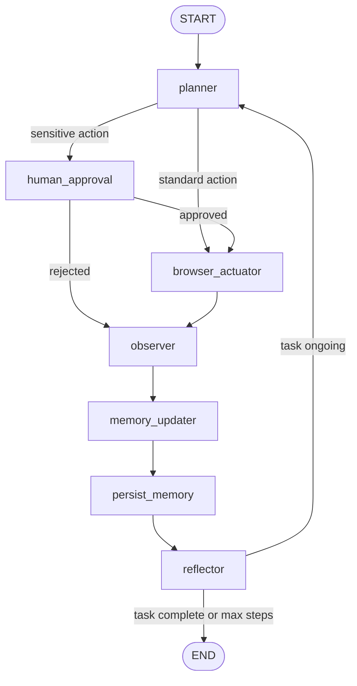
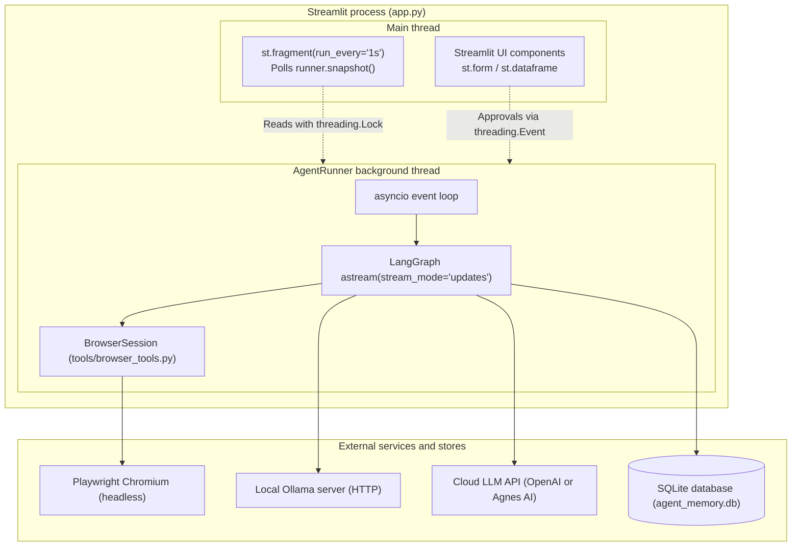

# Architecture

System architecture and data flow for the tool-using browser agent.

## Execution flow

The agent operates as a compiled LangGraph `StateGraph` (`graph.py`). Nodes execute sequentially or conditionally based on planner decisions and execution results.

### Node responsibilities

1. `planner` (`graph.py`): Calls the cloud language model with current task instructions, active browser tabs, and recent action history. Returns a structured `PlannerDecision` containing the next instruction, a boolean flag indicating if the action is sensitive, and reasoning.
2. `human_approval` (`graph.py`): Triggered when an action is flagged as sensitive by the planner or contains sensitive keywords. Suspends graph execution using LangGraph `interrupt()` until approved or rejected via the user interface.
3. `browser_actuator` (`graph.py`): Executes the planned instruction. Binds browser tools to the local Ollama model first. If the local model produces no tool call, it escalates to the cloud model. If execution raises a browser or selector exception, it flags the state for vision analysis and captures a screenshot.
4. `observer` (`graph.py`): Inspects the active page URL. If vision recovery was flagged, it passes the captured screenshot and failed instruction to the cloud vision model to generate remedial guidance.
5. `memory_updater` (`graph.py`): Deterministic node that appends the executed action to the in-memory history (bounded to 15 entries) and records extracted data if an extraction tool succeeded.
6. `persist_memory` (`graph.py`): Deterministic node that writes newly extracted records to the SQLite database.
7. `reflector` (`graph.py`): Evaluates whether the user task has been satisfied or if `max_steps` has been reached. Returns `status="done"` or `status="running"`.

## Runtime process model

The application runs inside a single process managed by Streamlit (`app.py`), separating user interface polling from asynchronous agent execution.

- **Thread boundaries:** `AgentRunner` initializes a daemon thread with an independent `asyncio` event loop. All Playwright browser operations remain pinned to this single event loop.
- **State synchronization:** State exchanges between the background runner and Streamlit's rendering loop occur through a mutex-locked snapshot (`threading.Lock`).
- **Human approval coordination:** When `human_approval` triggers `interrupt()`, the worker waits on a `threading.Event` (`_approval_event`). The Streamlit UI submits the user decision, clearing the event and resuming execution with `Command(resume=decision)`.

## Core types and state locations

| Type / Entity | Kind | Source location | Description |
| --- | --- | --- | --- |
| `AgentState` | `TypedDict` | `graph.py` | State dictionary passed across all LangGraph nodes, tracking task, tab mappings, action logs, extraction data, step counters, and errors. |
| `PlannerDecision` | `pydantic.BaseModel` | `graph.py` | Schema for planner output (`instruction: str`, `sensitive: bool`, `reasoning: str`). |
| `ReflectorDecision` | `pydantic.BaseModel` | `graph.py` | Schema for reflection output (`finished: bool`, `reasoning: str`). |
| `Settings` | `dataclass` | `config.py` | Runtime configuration values including provider selections, model identifiers, temperatures, and step limits. |
| `BrowserSession` | `class` | `tools/browser_tools.py` | Controller wrapping the Playwright Chromium instance, tab dictionary (`dict[str, Page]`), and action dispatchers. |
| `AgentRunner` | `class` | `app.py` | Container managing worker thread lifecycle, event loop initialization, mutex-protected snapshots, and approval signals. |
| `memory` table | SQLite table | `persistence.py` | Persistent schema storing columns `id`, `session_id`, `task`, `url`, `type`, `data_json`, and `created_at`. |

## External systems and network interfaces

1. **Ollama server:**
   - Transport: HTTP via `langchain_ollama.ChatOllama`.
   - Address: Configured by `OLLAMA_HOST` (default: `http://localhost:11434`).
   - Purpose: Primary model for low-latency tool calling and page interaction. Runs with `reasoning=False`.

2. **Cloud language model provider:**
   - Transport: HTTPS via `langchain_openai.ChatOpenAI`.
   - Provider `openai`: Connects to `OPENAI_BASE_URL` (or default OpenAI endpoints) using `OPENAI_API_KEY`.
   - Provider `agnes`: Connects to fixed endpoint `https://apihub.agnes-ai.com/v1` with model `agnes-2.5-flash` using `AGNES_API_KEY`.
   - Purpose: High-level planning, reflective stop decisions, screenshot vision recovery, and tool-call fallback.

3. **Playwright Chromium browser:**
   - Process: Headless Chromium browser binary launched through `async_playwright().chromium.launch(headless=True)`.
   - Isolation: Each tab opened with `open_new_tab()` invokes `browser.new_page()`, generating a separate `BrowserContext` with isolated cookies and cache.
   - Purpose: Direct DOM interaction, navigation, form inputs, element text extraction, and screenshot rendering.

4. **Local SQLite database:**
   - File location: Configured by `MEMORY_DB_PATH` (default: `./agent_memory.db`).
   - Driver: Standard library `sqlite3` without ORM.
   - Purpose: Long-term persistence of extracted text, tables, and links across application runs.
